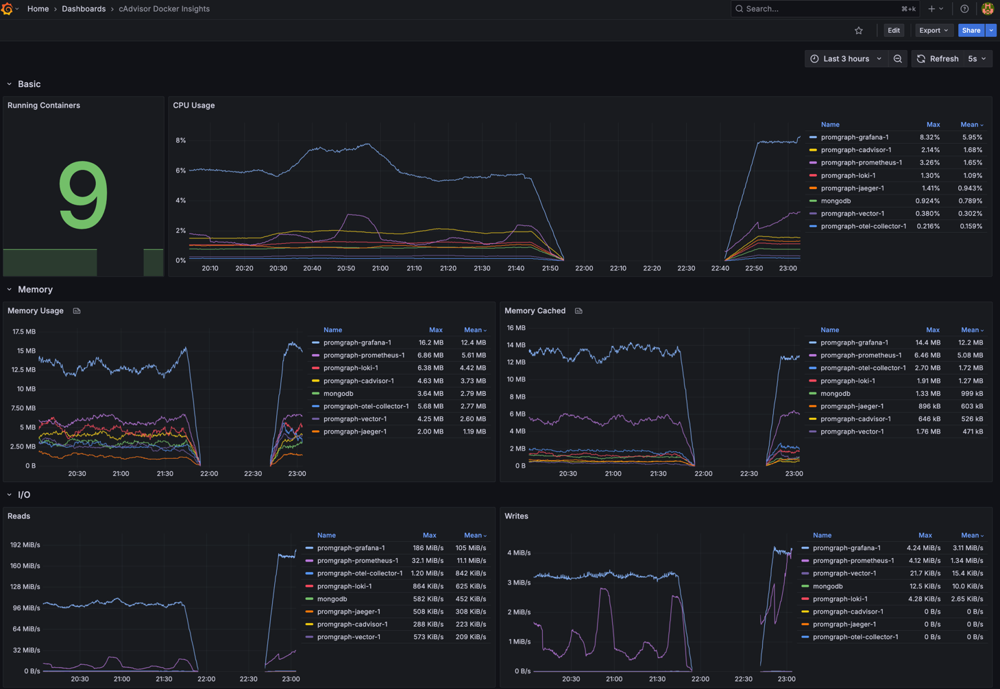
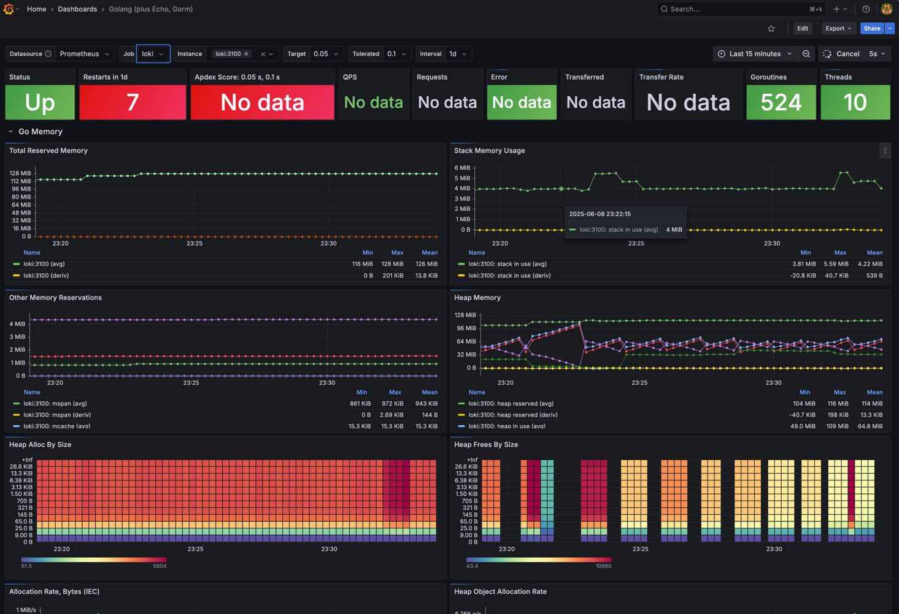
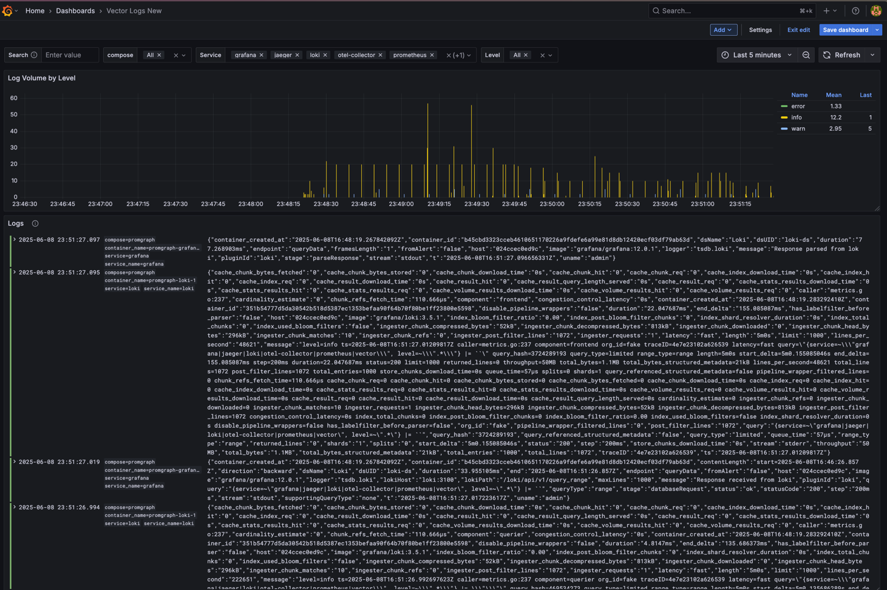
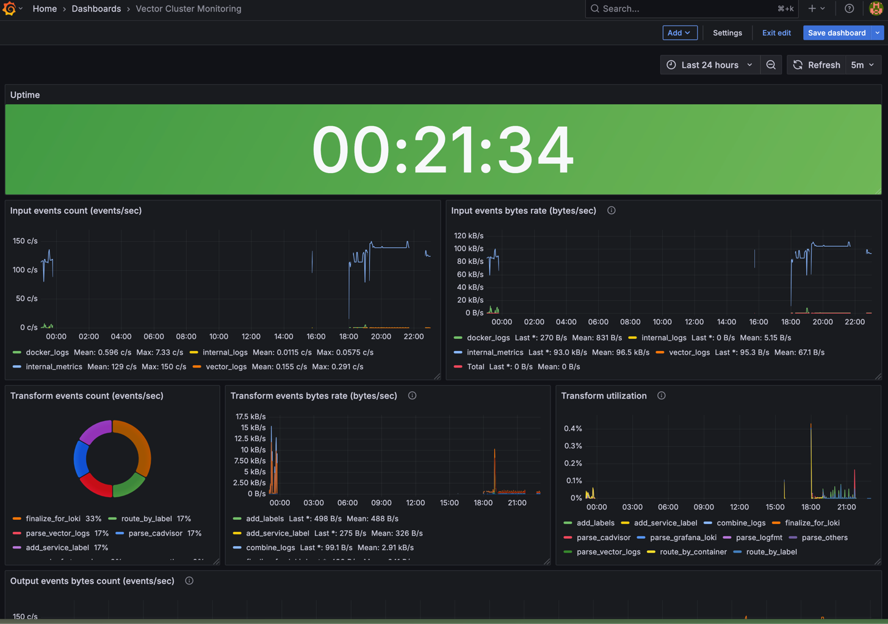

# My Local Observability Tool

Этот проект позволяет быстро развернуть локальный стек для мониторинга, сбора логов и трассировки приложений.

-----

## Что внутри?

* **Prometheus**: Собирает все твои метрики.
* **Grafana**: Красиво покажет тебе метрики, логи и трейсы.
* **Loki**: Хранилище для всех твоих логов.
* **Vector**: Обрабатывает и рулит логами с Docker-контейнеров.
* **cAdvisor**: Экспортирует метрики прямиком из Docker-контейнеров.
* **Jaeger**: Чисто для трейсов, ничего лишнего.
* **OpenTelemetry Collector**: Собирает и гонит трейсы в Jaeger.

-----

## Структура Проекта

* `.env`: Тут лежат переменные для Docker Compose, управляющие лимитами ресурсов.
* `docker-compose.yaml`: Главный файл, который запускает все сервисы.
* `Makefile`: Твоя палочка-выручалочка для управления стеком.
* `config/`: Здесь вся конфа.
  * `loki/loki.yaml`: Настройки Loki.
  * `otel/otel-collector.yaml`: Конфиг OpenTelemetry Collector.
  * `vector/vector.yaml`: Конфиг Vector.
  * `grafana/`:
    * `datasource.yaml`: Какие источники данных есть у Grafana (Loki, Prometheus, Jaeger).
    * `provisioning/dashboards/default.yaml`: Автозагрузка дашбордов в Grafana.
    * `my_entrypoint.sh`: Скрипт, который фиксит UID Prometheus в дашбордах Grafana.
  * `prometheus/prometheus.yaml`: Конфиг Prometheus с целями для сбора метрик.
* `data/`: Место, где хранятся постоянные данные (создаётся сам).
* `dashboards/`: JSON-файлы с дашбордами Grafana, которые автоматом подтянутся.
  * `cadvisor_docker.json`, `logs.json`, `vector.json`: Примеры дашбордов.

-----

### Готовые Дашборды Grafana

Есть несколько неизменяемых дашбордов. Которые автоматически загружаются в Grafana при запуске. Пожалуйста:

* **cAdvisor Dashboard**: Мониторинг метрик Docker-контейнеров.
  

* **Golang Dashboard**: Пример дашборда для мониторинга Golang-приложений (если применимо).
  

* **Logs Dashboard**: Визуализация логов из Loki.
  

* **Vector Dashboard**: Мониторинг работы Vector.
  

Чтобы поднять весь этот стек в фоне, просто набери:

```bash
make up
```

Это запустит всё: Prometheus, Grafana, Loki, Vector, cAdvisor, Jaeger и OpenTelemetry Collector.

-----

## Ресурсы

Ты, наверное, и сам знаешь, как добавить адреса в `/etc/hosts`. Но если лень, `make add-hosts` сделает это за тебя. А `make remove-hosts` непонятно зачем, но может вернуть все взад, они все равно будут жить вечно️ 😎.

```bash
make add-hosts
```

Вот список хостов, которые тебе пригодятся в других проектах как дефолтные значения: `grafana jaeger loki otel-collector prometheus vector`.

-----

### Ссылочки (после `make add-hosts`)

Что доступно в браузере (UI):

* **Grafana**: [http://grafana:3000](https://www.google.com/search?q=http://grafana:3000) *admin/admin (дефолт)*
* **Prometheus**: [http://prometheus:3001](https://www.google.com/search?q=http://prometheus:3001)
* **Jaeger UI**: [http://jaeger:16686](https://www.google.com/search?q=http://jaeger:16686)
* **Vector UI**: [http://vector:8383](https://www.google.com/search?q=http://vector:8383)
* **cAdvisor**: [http://cadvisor:9081](https://www.google.com/search?q=http://cadvisor:9081)

Что пригодится в проектах (интеграционные порты):

* **Loki**:
  * `loki:3100` (для приема логов от Promtail, Fluentd, Fluent Bit или Vector)
* **OpenTelemetry Collector**:
  * `otel-collector:9464` (порт метрик Prometheus для самого коллектора)
  * `otel-collector:4317 OTEL gRPC`
  * `otel-collector:4317 OTEL HTTP`
* **Vector**:
  * `vector:4545/udp` (для приема логов по UDP, например, Syslog)

-----

## Управление Сервисами

`Makefile` поможет тебе рулить стеком.

### Остановка и Удаление

Чтобы остановить и удалить все контейнеры:

```bash
make down
```

### Просмотр Логов

* Логи всех сервисов в реальном времени (последние 100 строк):
  ```bash
  make logs
  ```
* Логи конкретного сервиса (например, Loki):
  ```bash
  make logs-s s=loki
  ```

-----

## Очистка Данных

Для локальной разработки часто нужно сбросить данные.

### Очистка Всего

Эта команда остановит всё и удалит **все твои данные** (метрики Prometheus, логи Loki, данные Grafana, Jaeger и Vector):

```bash
make clean
```

### Очистка Отдельных Сервисов

Можешь почистить данные для конкретного сервиса:

* **Grafana**:
  ```bash
  make clean-grafana
  ```
* **Loki**:
  ```bash
  make clean-loki
  ```
* **Prometheus**:
  ```bash
  make clean-prometheus
  ```
* **Jaeger**:
  ```bash
  make clean-jaeger
  ```
* **Vector**:
  ```bash
  make clean-vector
  ```

-----

## Разработка и Отладка

### Пересборка и Перезапуск

Если что-то изменил в конфигах или Dockerfile'ах и хочешь полностью пересобрать и перезапустить (с чисткой данных):

```bash
make rebuild
```

### Валидация Конфигурации Vector

Прежде чем запускать Vector, можешь проверить его конфиг на ошибки:

```bash
make validate-vector
```

### Перезагрузка Grafana

Если поменял конфиг Grafana или дашборды, можешь "полностью перезагрузить" сервис Grafana (с очисткой данных):

```bash
make full-reload-grafana
```

-----

## Заметки по Конфигурации

* **Vector**: Собирает логи Docker, свою внутреннюю телеметрию и гонит всё в Loki. Ещё он экспортирует свои метрики для Prometheus.
* **Grafana**: Автоматом подтягивает источники данных и дашборды из нужных папок. Скрипт `my_entrypoint.sh` поправляет UID Prometheus в дашбордах.
* **Loki**: Хранит чанки и правила на файловой системе.
* **OpenTelemetry Collector**: Принимает метрики и трейсы по OTLP (gRPC и HTTP), экспортируя метрики в Prometheus и трейсы в Jaeger.
* **Ресурсы**: Лимиты CPU и памяти для некоторых сервисов (`GRAFANA_CPUS_LIMIT`, `LOKI_CPUS_LIMIT` и т.д.) можно настроить через `.env` файл.
